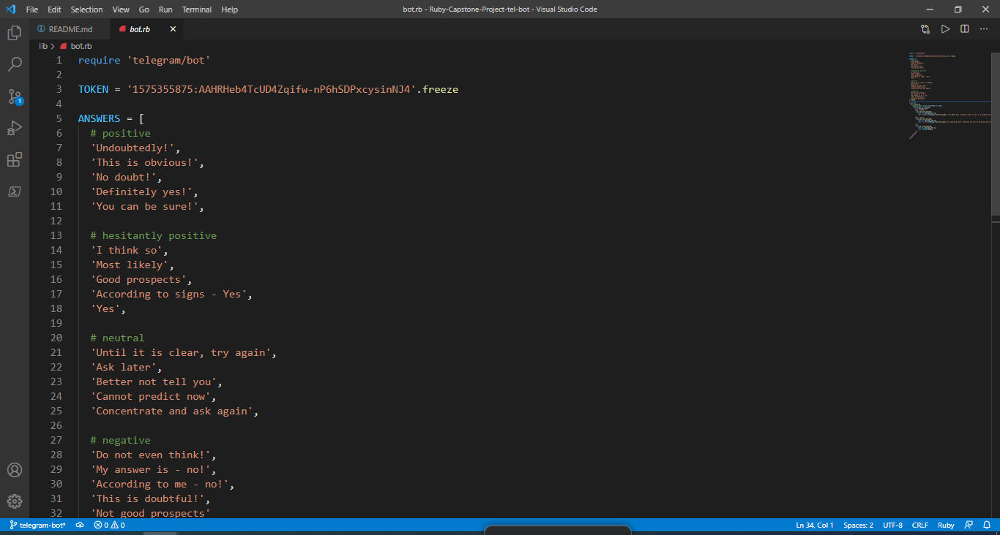

# Ruby-Capstone-Project-tel-bot

> In this project, I build a Telegram bot that gives advices in different manners and predicts your future conditions.

## Built With

- Ruby
- The Telegram Bot API

## How to Install

- First, you need to get a telegram account at [Telegram](https://web.telegram.org)
- Once you have an account, search for @BotFather, the Telegram bot-making wizard. This should open a chat with the BotFather.
- Now type '/newbot' and send to start a new bot and follow the instructions. The BotFather will ask you to choose a username and give you an API token. Keep this token secret.   It can be used to control your bot.
- Fork this repo and clone to your local machine.
- Cd into the repo and create a file in the main directory called 'token.rb'
- Inside token.rb, type 'TOKEN' and set it equal to the API token you got from the BotFather. Make sure the API token is in quotes to make it a string.

- Make sure you have Bundler installed in your machine. Once in the project folder (top level director), enter the command `bundle install` in your terminal. This will install the basic dependencies in the Gemfile.

- Now the rest of the app should run. Go to your terminal, cd into the 'bin' directory of the repo, and enter the command `ruby main.rb`.

- The bot should run. If you search for your bot by its username in Telegram, it should be ready to receive commands. 

- The bot responds to the commands 'start' and 'stop' and answers to your questions. 

- 'Start' will prompt the bot to give some basic info about itself.

- 'Stop' will stop the bot and predicts your future and gives some advises.

- Of course, you can alter the messages and commands in bot.rb to something you prefer.

##More Information

- for more information you can watch this  [video](https://www.loom.com/share/5690d164c4cc46928dade1249612524c)

## How to Run Tests

- If you ran `bundle install`, RSpec should be installed, along with all the other dependencies. To run the tests, cd into the top-level project folder and enter the command `rspec spec/test.rb`. This will run all tests.

## Author

👤 **Elyor Doniyorov**

- Github: [@Elyor](https://github.com/elyor-doniyorov)
- Linkedin: [Elyor](https://www.linkedin.com/in/elyor-doniyorov/)

## 🤝 Contributing

Contributions, issues and feature requests are welcome!

Feel free to check the [issues page](issues/).

## Show your support

Give a ⭐️ if you like this project!

## 📝 License

This project is [MIT](lic.url) licensed.
